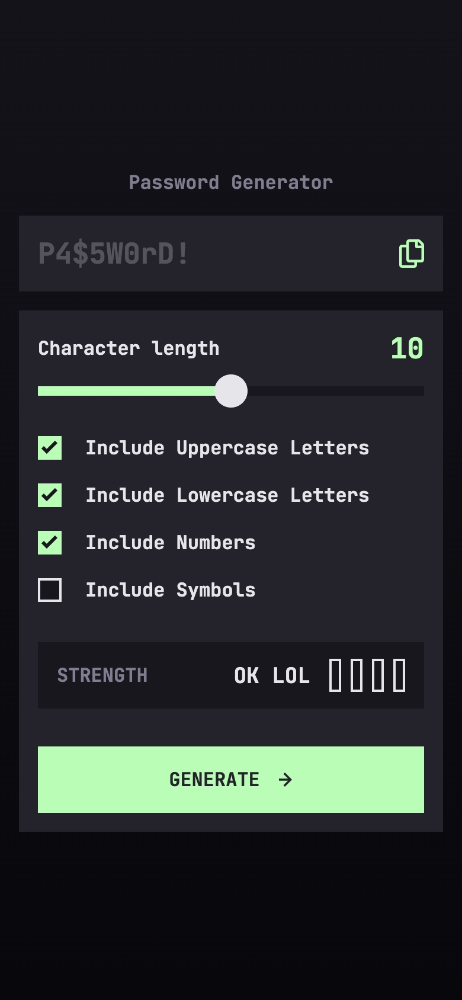
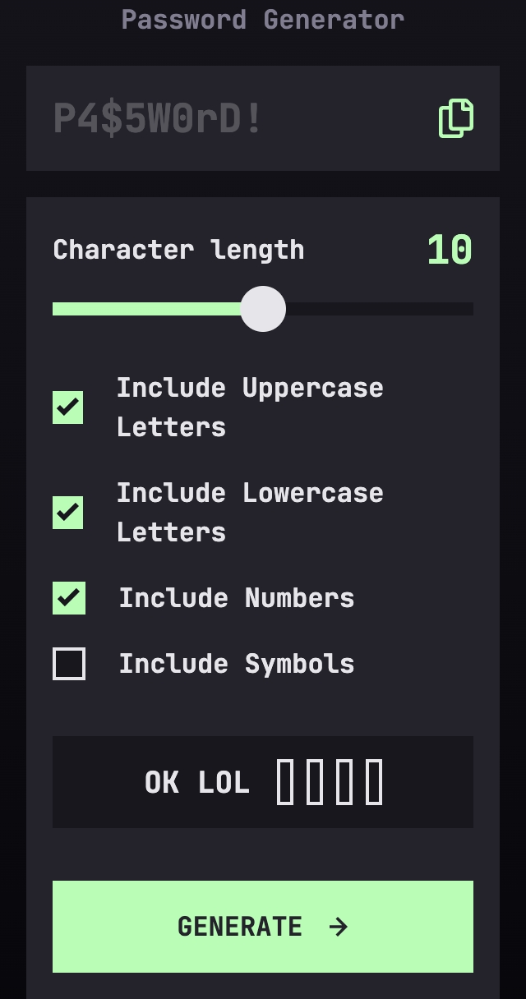

# Frontend Mentor - Password generator app solution

This is a solution to the [Password generator app challenge on Frontend Mentor](https://www.frontendmentor.io/challenges/password-generator-app-Mr8CLycqjh). Frontend Mentor challenges help you improve your coding skills by building realistic projects.

## Table of contents

- [Frontend Mentor - Password generator app solution](#frontend-mentor---password-generator-app-solution)
  - [Table of contents](#table-of-contents)
  - [Overview](#overview)
    - [The challenge](#the-challenge)
    - [Screenshot](#screenshot)
    - [Links](#links)
  - [Progress](#progress)
    - [Entries](#entries)
      - [Day 1](#day-1)
      - [Day 2](#day-2)
    - [Built with](#built-with)
    - [Useful resources](#useful-resources)

## Overview

### The challenge

Users should be able to:

- Generate a password based on the selected inclusion options
- Copy the generated password to the computer's clipboard
- See a strength rating for their generated password
- View the optimal layout for the interface depending on their device's screen size
- See hover and focus states for all interactive elements on the page

### Screenshot

<details>
<summary>Desktop</summary>


</details>

<details>
<summary>Mobile</summary>



</details>

<details>
<summary>Tiny Mobile</summary>



</details>

### Links

- [Live Site URL](https://password-generator-app.frilly.dev)

## Progress

### Entries

#### Day 1

This is the first challenge I encountered with the level 3 (Intermediate) on the 5-level scaling on Frontend Mentor. The design isn't very different across screen sizes from the first look, so responsive design shouldn't be a worry here. Initialized a new project with Astro, and set up the basic structure of the project. I also added the basic styling based on the color schemes provided in the Figma file for the project. I'm using Svelte instead of Vue this time even though I like Vue more.

First thing I noticed while extracting a SVG file to a separate component is that there are no "fallthrough attributes", like adding a `class=` on the parent component and it being applied directly to the top level element of the component. Was a fun feature, but seemed a bit unintuitive so I understand Svelte not having it.

Instant roadblock is the slider input, as there are no standards for styling it, you have to do it for each type of browser (Webkit, Chrome, Firefox, and IE), it got frustrating real quick. For some reason, borders don't work on the range input's thumb. In general:

- `-webkit-appearance: none;` removes the default styling of the input for Chrome and Safari
- `::-webkit-slider-thumb` and `::-webkit-slider-runnable-track` are the selectors for the thumb and the track of the slider for Chrome and Safari. There are **currently at the time of writing this, NO selectors for the progress of the slider for Chrome and Safari**.
- `::-moz-range-thumb` and `::-moz-range-track` are the selectors for the thumb and the track of the slider for Firefox. Styling the progress is possible with `::moz-range-progress`.
- `::-ms-thumb` and `::-ms-track` are the selectors for the thumb and the track of the slider for IE. Surprisingly, for IE, it's possible to style the progress with `::-ms-fill-lower` and `::-ms-fill-upper`. Finally one win for IE.

#### Day 2

I have wasted so many hours on styling this part it's unreal. Oh my gosh.... But the way of styling it correctly on Webkit, is using a `linear-gradient` on the track, like so:

```js
  // Function to change the --value property on the element everytime it changes (sliding back and forth)
  // For vanilla JS, bind this function to the input element's "input" event.
  function changeValueProperty(event: Event) {
    const target = event.target as HTMLInputElement;
    const [cur, max] = [parseInt(target.value), parseInt(target.max)];
    target.style.setProperty("--value", `${Math.round((cur / max) * 100)}%`);
  }

  // Function to set the value once the page loads.
  // For vanilla JS, bind this function to the dom's "DOMContentLoaded" event.
  onMount(() => {
    const input = document.getElementById("char-length") as HTMLInputElement;
    input.style.setProperty("--value", `${Math.round((value / 20) * 100)}%`);
  });
```

Other than that, everything was fine and dandy, and got working very fast. Was not very used to Svelte but managed to make what I wanted.

### Built with

- [Svelte](https://svelte.dev/)
- [Tailwind CSS](https://tailwindcss.com/)
- [Astro](https://astro.build/)
- [SCSS](https://sass-lang.com/)

### Useful resources

- [Styling sliders](https://css-tricks.com/styling-cross-browser-compatible-range-inputs-css/) - This article helped me style the range input for the password length.
- [Linear Gradient](https://developer.mozilla.org/en-US/docs/Web/CSS/gradient/linear-gradient) - MDN docs on linear gradients.
